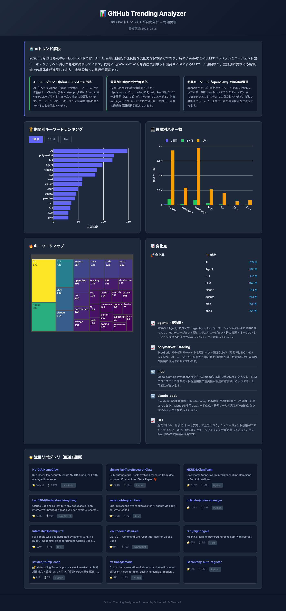
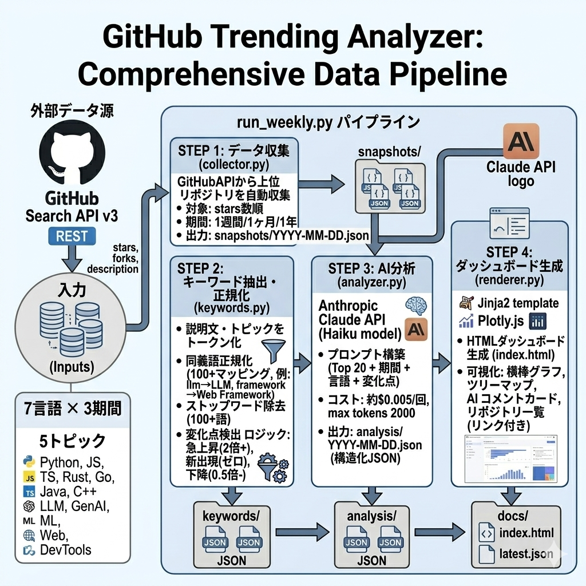

# GitHub Trending Analyzer

GitHub のトレンドリポジトリを自動収集し、AI がトレンドの背景を解説するインタラクティブダッシュボード。



---

## 特徴

- **GitHub API** でスター数上位リポジトリを言語・トピック別に自動収集
- **直近1週間 / 1ヶ月 / 1年** の3期間で比較し、変化点を検出
- **Claude AI** が「なぜこのトレンドが来たのか」を自動コメント
- **Plotly.js** によるインタラクティブな可視化（バーチャート・ツリーマップ）
- 週次自動実行に対応（GitHub Actions / cron）

---

## システム構成図



---

## 技術スタック

| カテゴリ | 技術 | 用途 |
|---------|------|------|
| **言語** | Python 3.10+ | バックエンド・パイプライン |
| **データ収集** | requests + GitHub Search API v3 | リポジトリ検索・メタデータ取得 |
| **NLP** | 独自キーワード抽出 | トークン化・同義語正規化・ストップワード除去 |
| **AI分析** | Anthropic Claude API (Haiku) | トレンド解説・変化点の考察生成 |
| **テンプレート** | Jinja2 | HTMLダッシュボード生成 |
| **可視化** | Plotly.js 2.35 | インタラクティブチャート |
| **フロントエンド** | Vanilla JS + CSS3 | ダークテーマ・レスポンシブUI |
| **環境管理** | python-dotenv | APIキー管理 |

---

## ディレクトリ構成

```
GitHub_Trending/
├── scripts/
│   └── run_weekly.py        # パイプライン実行スクリプト
├── src/
│   ├── config.py            # 定数・API設定・同義語辞書
│   ├── collector.py         # GitHub API データ収集
│   ├── keywords.py          # キーワード抽出・変化点検出
│   ├── analyzer.py          # Claude AI トレンド分析
│   └── renderer.py          # ダッシュボード生成
├── templates/
│   └── dashboard.html.j2    # HTMLテンプレート
├── data/
│   ├── snapshots/           # 生データ（日付別JSON）
│   ├── keywords/            # キーワード集計結果
│   └── analysis/            # AI分析結果
├── docs/
│   ├── index.html           # 生成されるダッシュボード
│   ├── assets/style.css     # ダークテーマCSS
│   └── data/latest.json     # フロントエンド用データ
├── .env                     # APIキー（Git管理外）
├── .env.example             # .envのテンプレート
└── pyproject.toml           # Python プロジェクト設定
```

---

## セットアップ

### 1. 依存パッケージのインストール

```bash
pip install requests python-dotenv anthropic jinja2
```

### 2. APIキーの設定

```bash
cp .env.example .env
```

`.env` を編集して2つのキーを設定：

```env
GITHUB_TOKEN=ghp_xxxxxxxxxxxxxxxxxxxx
ANTHROPIC_API_KEY=sk-ant-api03-xxxxxxxxxxxx
```

| キー | 取得先 |
|------|--------|
| `GITHUB_TOKEN` | [GitHub Settings > Developer settings > Personal access tokens](https://github.com/settings/tokens) |
| `ANTHROPIC_API_KEY` | [Anthropic Console > API keys](https://console.anthropic.com/settings/api-keys) |

### 3. 実行

```bash
python scripts/run_weekly.py
```

### 4. ダッシュボードを表示

```bash
cd docs && python -m http.server 8765
# ブラウザで http://localhost:8765 を開く
```

---

## 各モジュールの詳細

### collector.py — データ収集

GitHub Search API から7言語 × 3期間 + 5トピックのリポジトリを取得。

- **対象言語**: Python, JavaScript, TypeScript, Rust, Go, Java, C++
- **期間**: 直近1週間 / 1ヶ月 / 1年
- **トピック**: LLM, Generative AI, Machine Learning, Web Framework, DevTools
- **レート制限**: 自動検出・待機機能付き

### keywords.py — キーワード分析

リポジトリのトピックタグと説明文からキーワードを抽出。

- **同義語辞書**: 100以上のマッピングで表記揺れを正規化（例: `llm` → `LLM`）
- **ストップワード**: 一般的な英単語100語以上を除外
- **変化点検出**: 前週比2倍以上で「急上昇」、0.5倍以下で「下降」と判定

### analyzer.py — AI解説

キーワード集計結果をClaude Haiku に渡し、構造化された分析を生成。

- **出力**: 全体コメント + ハイライト（感情付き）+ 変化点の解説
- **コスト**: 1回あたり約$0.005（約0.8円）
- **安全装置**: max_tokens=2000, 1実行1回のみAPI呼び出し

### renderer.py — ダッシュボード生成

Jinja2テンプレートからHTMLを生成し、全データを `latest.json` に集約。

---

## ダッシュボードの機能

| セクション | 内容 |
|-----------|------|
| **AIトレンド解説** | Claude が生成したトレンド総評と注目ポイント |
| **キーワードランキング** | 期間切り替え可能な横棒グラフ（Top 15） |
| **言語別スター数** | プログラミング言語ごとのスター合計（期間別グループ） |
| **キーワードマップ** | ツリーマップによる出現頻度の面積表現 |
| **変化点** | 急上昇・新登場キーワードの一覧 |
| **注目リポジトリ** | 直近1週間のスター数上位リポジトリ（リンク付き） |

---

## コスト見積もり

| リソース | 無料枠 / コスト | 月間見積もり |
|---------|----------------|------------|
| GitHub API | 5,000回/時（認証済み） | 無料 |
| Claude Haiku API | $0.80/MTok (入力), $4.00/MTok (出力) | 約$0.02（週1回） |
| **合計** | | **月額約3円** |

---

## 週次自動実行

### 方法1: GitHub Actions（推奨・無料）

```yaml
# .github/workflows/weekly.yml
name: Weekly Trending Analysis
on:
  schedule:
    - cron: '0 0 * * 1'  # 毎週月曜 UTC 0:00
  workflow_dispatch:

jobs:
  analyze:
    runs-on: ubuntu-latest
    steps:
      - uses: actions/checkout@v4
      - uses: actions/setup-python@v5
        with:
          python-version: '3.11'
      - run: pip install requests python-dotenv anthropic jinja2
      - run: python scripts/run_weekly.py
        env:
          GITHUB_TOKEN: ${{ secrets.GH_TOKEN }}
          ANTHROPIC_API_KEY: ${{ secrets.ANTHROPIC_API_KEY }}
      - uses: stefanzweifel/git-auto-commit-action@v5
        with:
          commit_message: 'chore: weekly trending update'
```

### 方法2: ローカル cron

```bash
# crontab -e
0 9 * * 1 cd /path/to/GitHub_Trending && python scripts/run_weekly.py
```

---

## ライセンス

MIT

---

